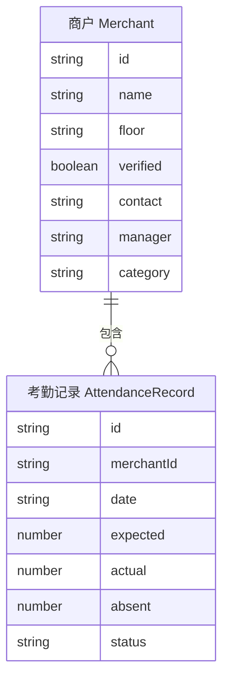

# 点名系统 H5 UI 技术架构文档

## 1. 架构设计

```mermaid
flowchart TD
    "A[前端 React H5]" --> "B[路由层 React Router]"
    "B[路由层 React Router]" --> "C[页面层 点名首页 / 商户详情页]"
    "C[页面层 点名首页 / 商户详情页]" --> "D[组件层 卡片/标签栏/导航栏/大圆/表格]"
    "D[组件层 卡片/标签栏/导航栏/大圆/表格]" --> "E[状态层 Zustand Mock 数据]"
    "E[状态层 Zustand Mock 数据]" --> "F[本地 Mock 数据 商户/考勤]"
```

## 2. 技术说明
- 前端：React@18 + TypeScript + Tailwind CSS@3 + Vite
- 初始化工具：vite-init（react-ts 模板）
- 后端：无（纯前端 Mock 数据演示）
- 数据：本地 Mock 数据（商户列表、考勤记录）
- 路由：react-router-dom
- 状态管理：zustand
- 图标库：lucide-react

## 3. 路由定义
| 路由 | 用途 |
|------|------|
| `/` | 点名首页（默认入口） |
| `/merchant/:id` | 商户详情页 |

## 4. API 定义
本项目为纯前端演示，无后端 API，所有数据使用本地 Mock。

## 5. 服务端架构
无后端服务。

## 6. 数据模型

### 6.1 数据模型定义



### 6.2 数据定义语言（Mock 数据结构）

```typescript
// 商户
interface Merchant {
  id: string;
  name: string;          // 商户名称
  floor: string;         // 楼层 1F/2F/3F/4F
  verified: boolean;     // 是否认证
  contact: string;       // 联系电话
  manager: string;       // 负责人
  category: string;      // 业态
}

// 每日考勤记录
interface AttendanceRecord {
  id: string;
  merchantId: string;
  date: string;          // 日期 YYYY-MM-DD
  expected: number;      // 应到
  actual: number;        // 实到
  absent: number;        // 缺勤
  rate: number;          // 到岗率
  status: 'normal' | 'abnormal';  // 状态
}
```

## 7. 设计令牌（Design Tokens）

| 令牌 | 值 | 用途 |
|------|-----|------|
| 主色 primary | #00b578 | 签到/激活态 |
| 警告色 warning | #ff9500 | 异常/缺勤 |
| 文本黑 text-primary | #1a1a1a | 主文本 |
| 文本灰 text-secondary | #666666 | 次要文本 |
| 浅灰背景 bg-base | #f5f5f5 | 页面背景 |
| 卡片背景 bg-card | #ffffff | 卡片背景 |
| 卡片圆角 radius-card | 16px | 卡片圆角 |
| 左右边距 spacing-x | 16px | 全局左右留白 |
| 商户名字号 fs-merchant | 22px | 商户名称 |
| 签到大圆 size-checkin | 170px | 签到大圆直径 |
| 副标题与大圆间距 gap-circle | 20px | 垂直间距 |

## 8. 组件结构

```
src/
├── pages/
│   ├── RollCallHome.tsx        # 点名首页
│   └── MerchantDetail.tsx      # 商户详情页
├── components/
│   ├── home/
│   │   ├── TopBar.tsx          # 顶部标题天气区
│   │   ├── ProgressCard.tsx    # 今日点名进度卡片
│   │   ├── FloorTabs.tsx       # 楼层筛选标签栏
│   │   ├── CheckinCard.tsx     # 商户签到卡片
│   │   ├── StatsBar.tsx        # 今日统计底部栏
│   │   └── BottomNav.tsx       # 底部导航栏
│   └── merchant/
│       ├── MerchantHeader.tsx  # 商户头部卡片
│       ├── ActionButtons.tsx   # 功能按钮组
│       ├── MerchantInfo.tsx    # 商户基础信息卡片
│       └── AttendanceTable.tsx # 本月每日考勤卡片
├── store/
│   └── useRollCallStore.ts     # Zustand 状态管理
├── data/
│   └── mockData.ts             # Mock 数据
└── App.tsx                     # 路由入口
```
